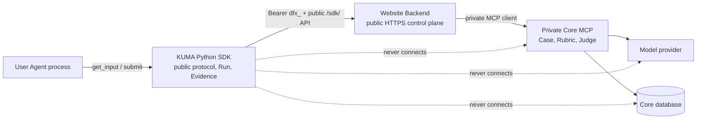
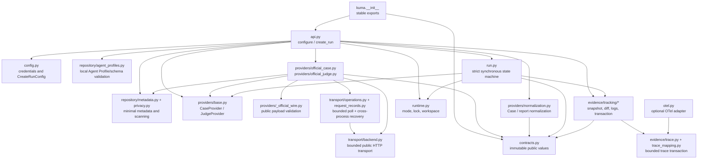
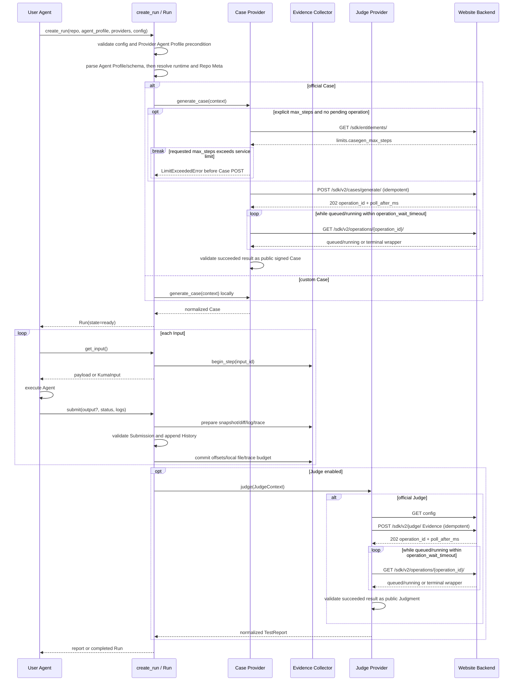
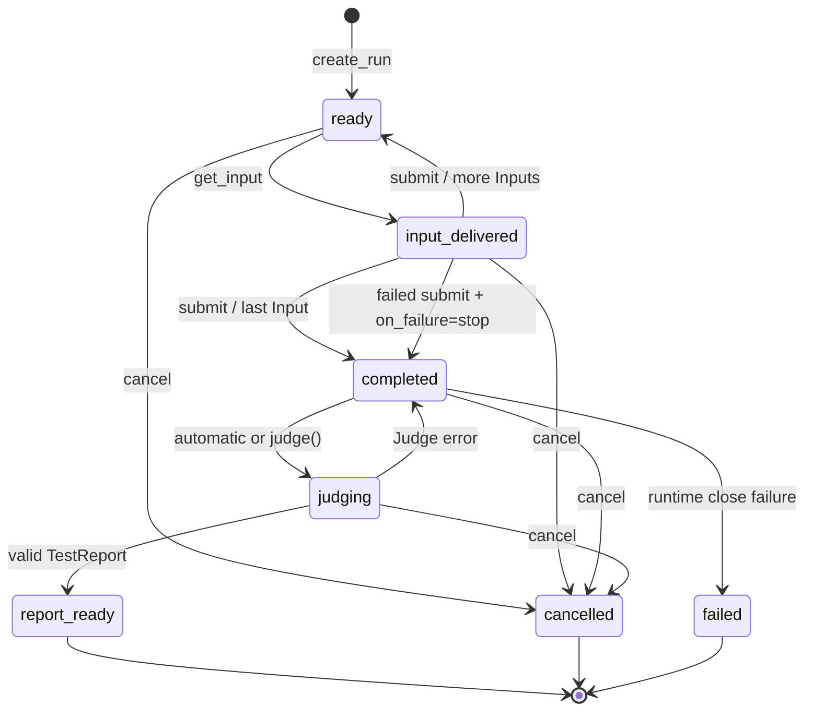
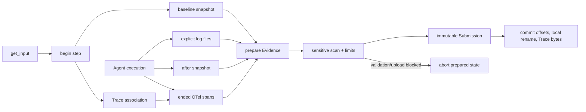

# SDK v4 架构

本文描述当前 `kuma` Python 包的模块边界、同步用户 API、内部 v2 operation 流程和关键不变量。公开 HTTP 字段与路径另见 [API Contract](api-contract.md)；使用方式见 [README](../README.md)。

## 系统边界与数据归属



SDK 只拥有公开客户端协议、Provider 端口、Run 状态机、运行锁、Evidence 构造和公开响应验证。它不知道服务端如何验证 API Key、计算 scope/配额/计费、选择模型、保存 Case/Judgment 或执行 Private Rubric。

Website Backend 是 SDK 唯一网络目标。它拥有 `dfx_` 鉴权、scope、配额/计费、公开输入和敏感数据校验、幂等入口、安全错误映射以及到 Core MCP 的私有客户端转发。Core MCP 拥有 Case、Private Rubric、Judge、模型调用、模型配置和核心数据库。Private Rubric、hidden answer、provider key、MCP 地址和模型配置都不能通过 Backend 响应进入 SDK。

## 包内模块与依赖方向



依赖从公开编排层指向更小的边界或纯数据模块。`contracts.py` 不执行 I/O；`BackendClient` 不拥有 Case/Judge 业务规则；OTel adapter 不依赖 Backend；自定义 Provider 不需要 transport。导入顶层 `kuma` 不读取环境、不创建文件、不启动线程，也不访问网络。

### Public API

- `kuma.configure(api_key=...)` 验证并原子写入当前用户凭证文件。
- `kuma.create_run(...)` 是 Run 工厂，解析配置、选择 Provider、执行预检并构造一个 Case 的 Run。
- `KumaClient` 读取公开 entitlements、Case strategy 和 Judge upload config；它是账户/动态配置兼容客户端，不执行 Run。
- `Run` 暴露 `get_input()`、`submit(output?)`、`judge()`、`cancel()` 以及只读 state/history/report/warnings。省略 output 时只读取当前步骤标准 OTel Agent/Workflow 输出；显式 output 是无 OTel Agent 的兼容路径并始终优先。
- `contracts.py` 中的 dataclass 是不可变、经 schema major 验证的 JSON 边界值。
- `kuma.providers` 暴露自定义 Provider Protocol、context、adapters 和官方 Provider。
- `create_run()` 在安装 `[otel]` 且全局 OTel SDK Provider 可用时自动挂载；`kuma.otel` 继续暴露显式 attach API 和 Trace limits 供高级配置。

### Provider

`CaseProvider.generate_case(CaseGenerationContext)` 接收本地 Agent Profile、公开 Repo Meta、input 类型/schema、strategy 和数量上限。输出只能是文档列出的 `Case`、带必需 `inputs` 的 Case mapping、单个文本/`KumaInput` 或 `list`/`tuple` Inputs；任意 mapping fallback 和任意 iterable 不再进入 Input。`normalize_case()` 在交付第一个 Input 前递归拒绝私有评测字段，再构造完整 `Case`。

`JudgeProvider.judge(JudgeContext)` 接收已归一化 Case、不可变 History、Run status 和 Evidence summary。输出必须经 `normalize_report()` 转成 `TestReport`。Provider 抛出的 `KumaError` 保持类型；其他异常按官方或自定义 Provider 分别包装成不泄漏内部异常文本的 `ProviderError`。自定义 Case 不允许携带调用方 Rubric；官方 Judge 直接接收 closed 公共 Case，Core 独占私有评价策略。

官方 Provider 是这两个端口的 HTTP 实现：

- `OfficialCaseProvider` 不把 strategy catalog 查询作为 CaseGen 前置条件。显式模式只指定 ID；`auto` 不在客户端选择或发送 version。`CaseGenerationContext.max_steps` 是公共 Provider 协议的结果上限；直接构造 Provider 时，构造器中的显式值必须与 context 一致，否则在网络请求前拒绝。用户显式设置非默认上限时，新请求先从 entitlements 读取服务端上限；超限在 Case POST 前以带安全最大值的 `case_step_limit_exceeded` 拒绝。已有 pending operation 跳过该预检并恢复原 operation，避免配置漂移破坏幂等。两种模式都只上传最小 Repo Meta、纯 frontmatter `agent_description`，以及从 Agent Profile 三个必填章节提取并受 UTF-8 字节边界和敏感扫描保护的 `behavior_spec`；不会上传原始 Agent Profile、schema、路径或仓库正文。响应记录 Backend/Core 的实际 strategy/version，并校验 batch/case 一致、fingerprint、signature 和私有字段缺失。`KumaClient.strategies()` 仅供用户显式查询。
- `OfficialJudgeProvider` 先读取动态上传限制，再构建 multipart evidence。单 Run 的幂等键在重试和手动 `run.judge()` 重试间保持稳定。
- Run Evidence 超过服务端单文件预算时，SDK 只在 HTTP transport projection 中按稳定顺序截断 raw log content，再移除尾部 OTel spans；本地不可变 `Submission` 不变。投影保留日志哈希/offset、Trace envelope 和所有 Input/Submission，并通过 `transport_projection`、`complete/truncated`、`dropped_count`、`missing` 与 capture reasons 明确暴露缺口。若仅靠这两类冗余内容仍无法满足预算，上传失败而不会删除 output、file evidence 或其他结构。
- `OfficialJudgeProvider.judge_batch()` 是同步 Provider 级 API；它验证 Backend 的动态 batch 上限，保持输入顺序，并把每项成功或安全错误归一化为 `JudgeBatchResult`。

### Transport

`transport/backend.py` 是唯一公网 transport：

- 只允许 `GET`/`POST` 和 base URL 下的 `/sdk/` 路径；非 loopback 地址必须使用 HTTPS。
- 使用 `Authorization: Bearer dfx_...`、JSON `Accept` 和 SDK `User-Agent`。
- 所有 POST 必须有 1–255 字节的 printable ASCII 幂等键。
- JSON/multipart 在首次请求前完成序列化；重试复用同一 body 和幂等键。
- `timeout` 是每次公网请求尝试的正有限秒数；`operation_wait_timeout` 是官方单 Case/Judge 的独立总等待预算，默认 600 秒。重试仅限安全错误 envelope 标记的瞬态失败，使用指数退避且 `max_retries` 限制为 0–5。`ServiceBusyError` 不会自动重试。
- 单次公网响应最多读取 8 MiB；超限响应在 JSON 解析前失败，HTTP 响应句柄始终释放。
- 对所有响应验证 JSON mapping 和公开字段；畸形响应不会成为成功对象。
- Backend 任意 `details` 不进入异常文本或 SDK error details；唯一例外是 `case_step_limit_exceeded.details.max_allowed_steps` 这一经过闭集、类型和范围验证的公开整数。

## `create_run()` 编排与调用流程

`create_run()` 先完成纯配置校验，再适配 Case Provider 并验证、解析其 Agent Profile。缺失或无效 Agent Profile 会在 OTel 自动接入、凭据解析、entitlements 协商、仓库扫描和 Runtime 创建前失败；有效 Agent Profile 才进入后续官方协商与 Case 生成。



只有 official Provider 分支访问网络。自定义 Case + 自定义 Judge（或 `judge=False`）可完全本地运行。混合组合只为官方那一侧创建 `BackendClient`。

Python API 表面仍是同步的：`create_run()` 和 `judge()` 在有界等待内返回终态或抛出稳定异常，不向调用者暴露 operation polling。只有单 Case/单 Judge 使用 v2 operation；`POST /sdk/judge/batch/` 保持 v1 同步批量合同。

## Run 状态机



关键不变量：

1. 同一 Run 最多有一个已交付但未提交的 Input；重复 `get_input()` 不前进。
2. History 中 `KumaInput` 与 `Submission` 的 run/case/input ID 必须一致。
3. Input payload 与 output 在记录前必须是无 NaN/Infinity、无循环且最多 256 层容器的 JSON 值；共享无环子对象合法。completed submission 必须有 output，结构错误必须在 Evidence/persistence/network 前以稳定安全错误返回。
4. Evidence 先 prepare，History 成功记录后才 commit。Submission 构造或 History 记录失败会 abort，不推进日志 offset、Trace Run 预算或本地 final file。
5. Judge 对 Python 调用者保持同步；Official Provider 内部 POST v2 operation 并轮询终态。Judge 失败只把状态恢复为 `completed`，不删除真实 History，也不伪造报告。`.kuma/requests/` 保留不含请求正文与凭证的终态记录；已接受响应丢失时通过客户端请求 ID 找回 operation，再仅用 GET 恢复，Judge 报告写入 `.kuma/reports/`。
6. cancel/finish 释放 OS lock 和临时 workspace；cancel 同时丢弃 active Trace association，迟到 span 不得串入下一 Run。

## Tracking、Evidence 与隐私



`repository/metadata.py` 是 Case 请求的最小化边界：只允许 schema version、基于公开 tree 的 fingerprint、相对 path、file/directory type、file size，以及 bounded truncation metadata。它不读取文件内容，并排除 `.git`、`.kuma`、依赖/build/cache 目录和敏感文件名。

`evidence/tracking` 在每个 Input 周围采集文件状态和显式日志增量。日志 tracker
在构造时绑定该 Run 的 canonical repo root；相对路径不依赖进程 cwd，路径组件
先做 lexical boundary 与 symlink/reparse 检查，内部绝对路径只作为未序列化的
offset key。History、持久化 Evidence 和 Judge wire 仅保留 repo-relative path
与稳定的 index reason。`upload_diff=False` 时文件 Evidence 不包含文本内容；
开启 diff 或传入日志会增加敏感数据面。发送给官方 Judge 前，SDK 扫描 output、
error、path、diff、log 和 custom Case。默认命中即抛出 `SensitiveDataError`，
Run 保持当前 Input 可重试。

Evidence 的完整性不由单个布尔值掩盖。`CaptureStatus` 分组件记录 complete/partial/failed/skipped，`missing` 给出缺失原因，`dropped_count` 给出丢弃数量，非致命运行问题进入 `runtime_warnings`。`save_local=True` 将同一结构写入 `.kuma/runs/<run_id>/submissions/`，先写 pending file，提交后 rename；本地保存失败只产生 warning，不伪造提交状态。

每个已关联 Run/Case/Input 的 Submission 还会生成并在本地保存
[`defuzex.runtime_evidence.v1`](runtime-evidence.md) 公开 envelope。它使用闭合
typed component union，只传关联 ID、顺序、路径/大小、结果枚举和 SHA-256。
Official Judge 通过公开 Judge config 的 `evidence_types` 协商传输：明确广告 v2
时，SDK 从已提交的 frozen output 生成不修改本地历史的 v2 transport projection，
只给 completed response claim 增加经强制敏感扫描和 4 MiB canonical JSON 上限约束的
`agent_output` JSON。仅广告 v1 时保持 hash-only v1；未广告 typed schema 的旧
服务仍收到 `defuzex.run_evidence.v1`。SDK 不把日志、Trace、prompt、completion、
diff 或 tool/model payload 混为 Agent output，也不从文本、OTel span name 或
框架事件推断 tool/command/test/state 事实。

## OpenTelemetry 适配

`create_run()` 在没有显式 capture 时按需导入 `otel.py`。若当前全局 Provider 暴露 SDK `TracerProvider.add_span_processor()`，适配器会自动增加一次 span 处理器并跨顺序 Run 复用；若全局 SDK `LoggerProvider` 可用，也增加一次原生 Logs 处理器。显式 `configure_trace_evidence()` capture 优先，可用于非全局 Provider 和自定义 limits。两种路径都不设置或替换任何全局 provider，因此可与已有 processor/exporter 和 instrumentation 共存。未安装 `[otel]`、Provider 未配置或不可自动安全复用时保持 no-op，并记录非阻断的 `trace_auto_capture_unavailable` runtime warning；意外 attach 失败只产生 `trace_auto_attach_failed` warning。两者都不影响 Run。

span 在 start 时绑定到 capture 当前唯一 active step，因此同进程线程池不依赖 `ContextVar` 继承；在 end 时才映射和导出。capture window 从 `get_input()` 打开，到 `submit()` force-flush 后冻结 Evidence 时关闭。标准 processor 的 span 必须在窗口内开始并在关闭前结束；窗口前开始但窗口内结束、以及关闭时仍打开的 span 都按 `trace_span_outside_window` 计数并降低完整性。完全发生在窗口外的 span 没有安全 step 归属，因此不向前后 Run 追记。父 span 可以先于或后于 child 结束，JSON 使用 ID 保留关系，并按开始时间稳定排序。commit 才累计整个 Run 的字节预算，abort 可恢复同一 association。

省略 `submit(output)` 的自动输出只读取 `invoke_agent`/`invoke_workflow` span 的 `gen_ai.output.messages` attribute 或 event。显式 output 优先；同一 span 的最后有效 event 覆盖 attribute；多 span 时 Workflow 结果始终优先于 Agent 结果，同类候选再按结束时间和 span ID 稳定选择。候选输出在内存中有界且不会复制进 Trace JSON，随后仍经过 Submission JSON 校验和敏感扫描。没有合法候选时保持当前 Input 并返回安全的 `output_invalid`，要求调用者显式提交。只要 instrumentation 明确给出最终输出，OTel 的 `error` span 状态不会被 SDK 当作业务失败依据；Trace status 仍原样保留。

`evidence/trace_mapping.py` 是纯映射边界。它保留标准 ID、时间、kind/status、events、resource 和 scope，并使用拒绝式 allowlist 过滤 attributes。`max_attributes` 在 allowlist 后限制保留项；每个排除项都计入 dropped accounting，普通未允许键与明确敏感键分别使用稳定 reason，privacy 分类不再依靠含糊 substring 决定是否计数。仅允许受控 `gen_ai` 模型/usage/latency 字段及少量 service/OTel resource 字段；prompt、completion、源码、文件/日志正文、token/key 和 Private Rubric 永远不允许。限制覆盖 span、attribute、event、文本和整个 Run 的完整紧凑 JSON envelope；任何丢失或截断都不得报告 `complete`，Exporter/serialization/flush 异常不得破坏 Run。

`_otel_log_mapping.py` 将同一 active step 内的原生 LogRecord 映射到一个版本化 JSON log segment。它只保留时间、severity、trace/span 关联、安全 resource/scope、正文/event hash 和 attribute 计数；原始 body、event name 与普通 attribute 值不会进入内存中的 Evidence payload。segment 复用既有 `Submission.logs` wire，并在 `runtime_evidence` 中投影为 hash-only `artifact_snapshot`，不新增 Core component 类型。record 数与每 Run 完整 JSON 字节均有独立硬上限；prepare/commit/abort 与 span Evidence 共用事务生命周期。

成功的公共 wire extension 是：

```text
Submission.extensions["trace_evidence"]
  -> Official Judge history[].submission.trace_evidence
  -> defuzex.trace_evidence.v1
```

这是向后兼容的 Evidence 扩展，不是新的 transport 或服务协议。SDK 不实现 OTLP receiver、跨进程关联、Trace 查询、UI 或服务端存储。

## 不属于 SDK 的职责

以下能力不得在本仓库实现：

- Website Backend 的 API Key 生成、hash、撤销、scope、配额、计费和服务端幂等记录。
- Backend 到 Core MCP 的 service credential、MCP 地址、错误内部详情或路由策略。
- Case/Private Rubric/Judgment 数据库、Prompt、hidden answer、模型选择、DeepSeek Key 或模型调用。
- Celery、job polling、队列、缓存、OTLP receiver、Trace UI 或部署脚本。

如果这些职责需要变化，应在对应服务仓库版本化其边界；SDK 只在公开 HTTPS 契约被确认后适配公开字段。
