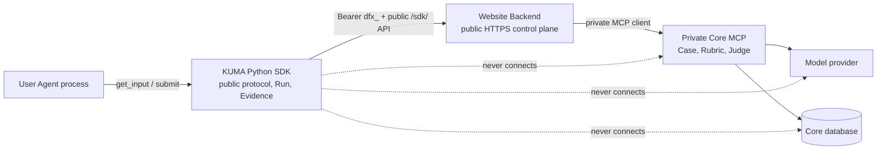
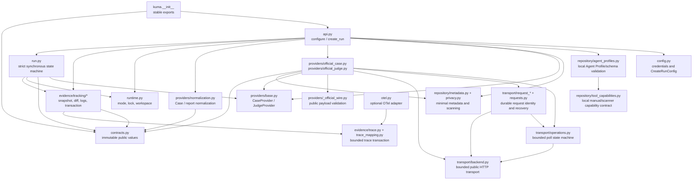
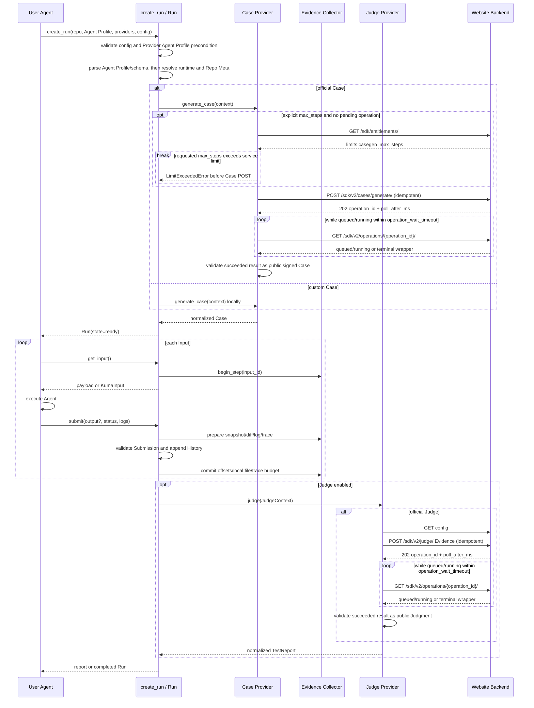
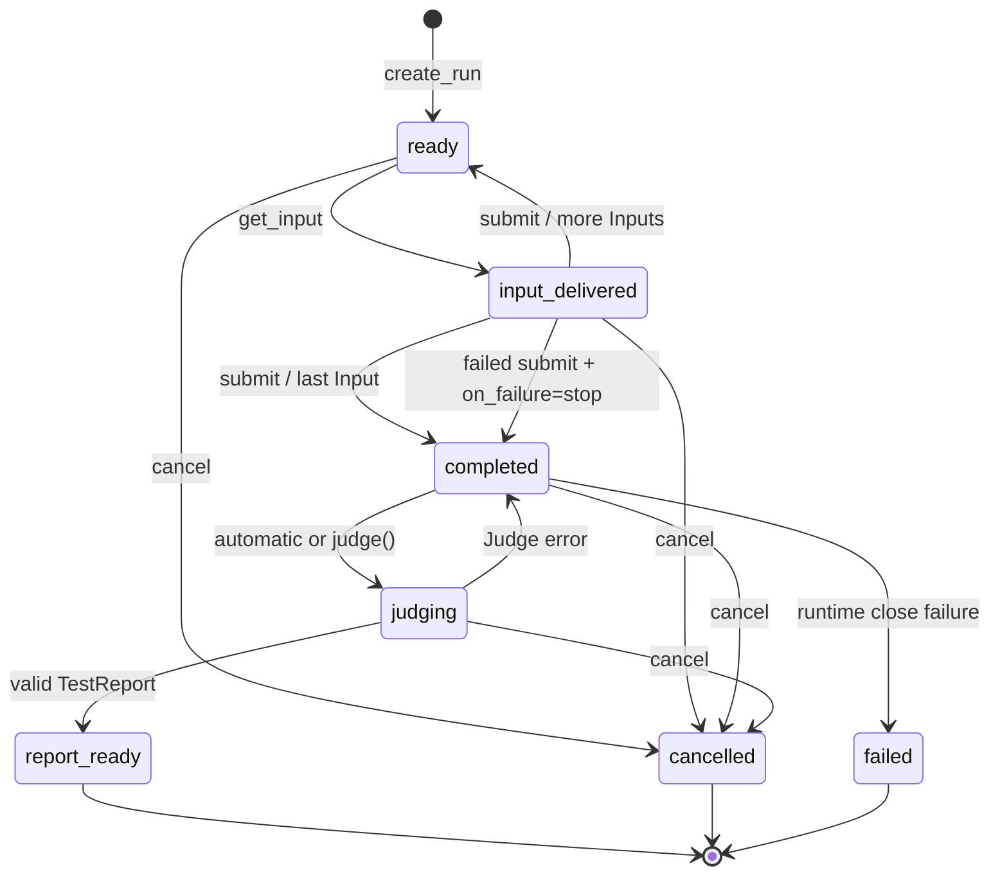
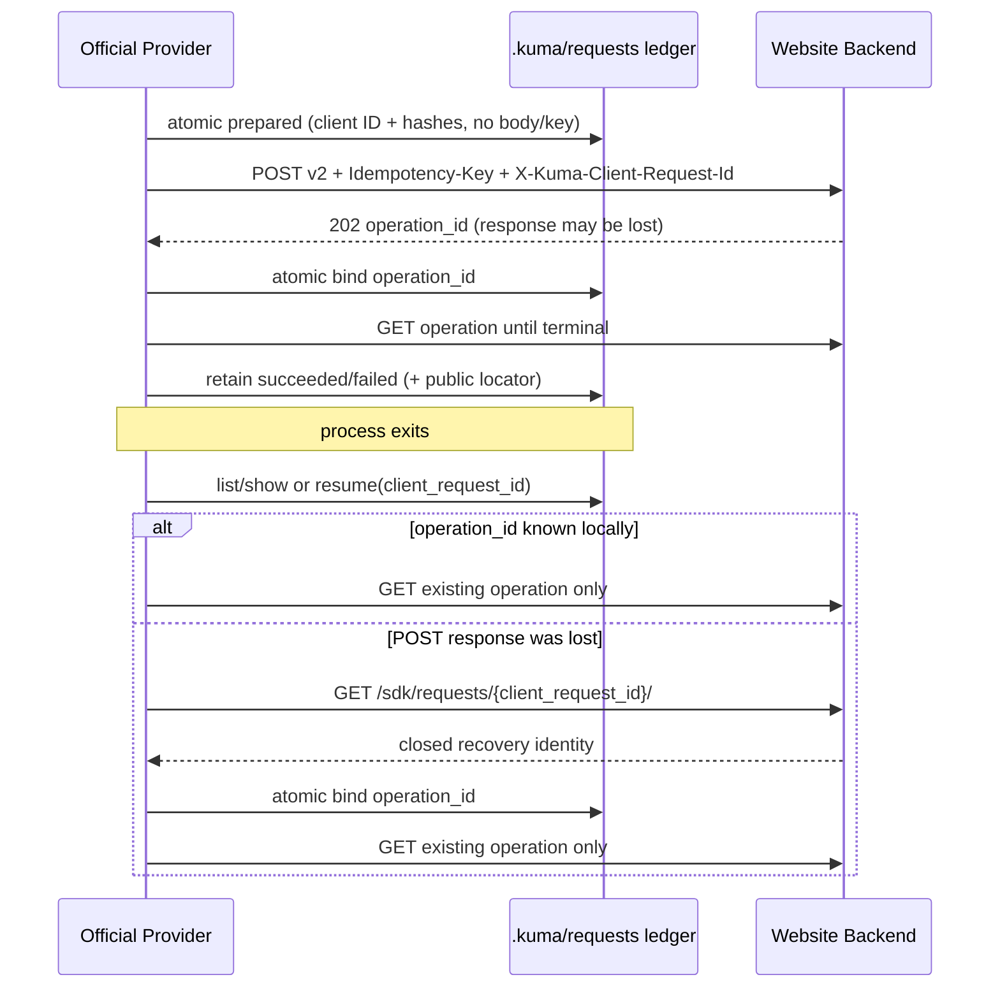
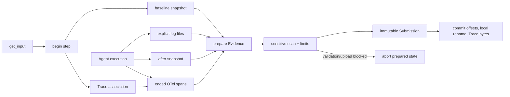

# SDK v4 architecture

This document describes the kuma package's module boundaries, synchronous user
API, internal v2 operation flow and invariants. See [API Contract](api-contract.md)
for public HTTP fields/routes and [README](../README.md) for usage.

## System boundaries and data ownership

Business data travels through the Backend control plane only. The separate
anonymous kuma.updates GitHub Release check sends no business parameters or API
key. Successful official transport schedules a daemon check with in-process
caching and nonblocking reservation-lock deduplication. It does not wait, write
to disk, delay business work or block process exit. KUMA_DISABLE_UPDATE_CHECK=1
disables it; local/custom/import/help paths do not trigger it.



SDK owns public client protocols, Provider ports, Run state, runtime locks,
Evidence construction and public-response validation. It does not implement
server key validation, scope/quota/billing, model selection, Case/Judgment storage
or Private Rubric execution.

Website Backend is the SDK's business-network boundary: dfx_ authentication,
scope, quota/billing, public-input/privacy validation, idempotent entry metadata,
safe errors and private forwarding to Core MCP. Core owns Cases, Private Rubrics,
Judge, model calls/configuration and its database. Private Rubrics, hidden answers,
provider keys, MCP addresses and model configuration must not reach SDK responses.

## Package modules and dependency direction



Dependencies point from public orchestration to smaller boundaries or pure data
modules. contracts.py performs no I/O; BackendClient owns no Case/Judge domain
rules; OTel adapters do not depend on Backend; custom Providers need no transport.
Importing kuma reads no environment, creates no files/threads and performs no network I/O.

### Public API

- `kuma.configure(api_key=...)` validates and atomically writes the user's credential file.
- `kuma.create_run(...)` parses configuration, selects Providers, runs preflight
  and constructs one Case's Run.
- Strategy Group authoritatively selects tested capability, domain and method.
  Agent Profile describes Agent/scenario/expected behavior/prohibited boundaries,
  never selects a Group through prose. Explicit coordinates stay unchanged;
  omission uses catalog default. Automatic capability matching is disabled.
- `KumaClient` reads public entitlements, strategies and dynamic Judge upload
  configuration; it does not execute a Run. Observation APIs are described separately.
- `Run` exposes get_input(), submit(output?), judge(), cancel() and read-only
  state/history/report/warnings. Omitted output reads current-step standard OTel
  Agent/Workflow output only; explicit output always takes priority.
- list_requests()/show_request() inspect the safe repo-local ledger offline.
  resume_request() recovers that ID's accepted operation, never creates a new
  task or reconstructs a Run capable of continuing Inputs.
- contracts.py dataclasses are immutable, schema-major-validated JSON boundary values.
- kuma.providers exports custom Provider protocols, contexts, adapters and official Providers.
- scan_agent_tools(), load_agent_capabilities() and save_agent_capabilities()
  manage local kuma.agent_tool_capabilities.v1 files. Scanner only normalizes
  explicitly supplied plain JSON manifests; manual/scanner share one schema.
  Agent Profile and Run retain local path/provenance; custom Providers may read
  the canonical mapping. Official Case revalidates/uploads the entire document
  only when explicitly linked. It is Group context, not Evidence or automatic selection.
- With the optional otel extra and a compatible global SDK Provider, create_run()
  attaches automatically; kuma.otel retains explicit attachment/limits for advanced use.

### Provider

CaseProvider.generate_case(CaseGenerationContext) receives local Agent Profile,
public Repo Meta, input type/schema, resolved Group and count bound. Group leads;
Profile is context. Results are Case, a Case mapping with required inputs, one
text/KumaInput or a list/tuple of Inputs, not arbitrary mappings or iterables.
normalize_case() recursively rejects private evaluation fields before the first
Input is delivered and constructs the complete Case.

JudgeProvider.judge(JudgeContext) receives normalized Case, immutable History,
Run status and Evidence summary. normalize_report() validates the result as
TestReport. KumaError retains its type; other exceptions become ProviderError
without leaking their original internal text.

Official Providers implement these ports over HTTP:

- OfficialCaseProvider reads the public catalog even for Case-only execution.
  Explicit structured selection wins; otherwise it uses exact catalog default,
  independently of Judge/Evidence switches. Capability matching remains disabled.
  Older Backend omission compatibility is allowed only without explicit Group.
  CaseGenerationContext.max_steps governs wire/result limits; an explicit
  constructor limit must match or fail before networking. New explicit-limit
  requests read entitlements and reject excess before POST with
  case_step_limit_exceeded and a safe maximum. Pending operations skip repeat
  preflight to preserve identity across configuration drift. Upload contains
  minimal Repo Meta, frontmatter agent_description and bounded behavior_spec
  from three required sections. Explicit tool_capabilities includes full schema
  descriptions/defaults/examples, not local paths; it participates in hashing,
  cannot bypass private/sensitive checks through allow_sensitive, and is never
  silently removed for retry. Raw Profile/repository bodies are not uploaded.
  Responses validate actual reported group coordinates, batch/Case consistency,
  fingerprint/signature and absence of private fields.
- OfficialJudgeProvider reads dynamic limits then builds multipart Evidence.
  One Run's identity remains stable across transport/manual judge retries.
- Oversized Evidence is reduced only in HTTP projection: bounded raw-log text
  first, then trailing OTel spans, without mutating local Submission. Log hashes/
  offsets, Trace envelope and all Inputs/Submissions remain. transport_projection,
  complete/truncated, dropped_count, missing and reasons expose gaps. If those
  reductions cannot fit, upload fails instead of deleting output/file Evidence.
- judge_batch() stays synchronous, respects dynamic batch limits, preserves
  input order and returns normalized per-item success/safe error in JudgeBatchResult.

### Transport

`transport/backend.py` owns public business transport:

- GET/POST use bounded /sdk/ routes under the base URL. DELETE is restricted to
  the explicit observation resource; arbitrary methods/routes are rejected.
  Nonloopback addresses require HTTPS.
- Requests use Bearer dfx_ credentials, JSON Accept and the SDK User-Agent.
- POST requires a 1–255-byte printable ASCII idempotency key.
- JSON/multipart is serialized before first request; retries reuse body and identity.
- timeout is positive finite seconds per attempt; operation_wait_timeout is a
  separate single-Case/Judge total budget, default 600 seconds. Only safe transient
  envelopes permit exponential backoff, with max_retries 0–5; ServiceBusyError
  does not retry automatically.
- Responses are capped at 8 MiB before JSON parsing; handles are always released.
- Public JSON mapping/fields are validated; malformed responses cannot become success.
- Arbitrary Backend details are not echoed. Only explicitly closed/type/range
  validated public fields, such as max_allowed_steps, enter safe error metadata.

## create_run orchestration

create_run() completes pure option validation before adapting Case Provider and
parsing its Agent Profile. Missing/invalid Profile fails before OTel attachment,
credential resolution, entitlement negotiation, repository scanning or runtime
creation. A valid Profile remains context, never changing explicit/default Group.



Only official Provider branches require networking. Custom Case plus custom
Judge or judge=False can stay local; mixed combinations create BackendClient
only for the official side. Custom Case plus official Judge uses a closed,
Rubric-free public multipart Case: no rubric_id, case_revision_id or criteria;
the server judges its public Case and Evidence directly.

Python remains synchronous: create_run()/judge() return terminal results within
bounded waits or raise stable errors, hiding polling. Only single Case/Judge
uses v2 operations; POST /sdk/judge/batch/ retains its synchronous v1 contract.

## Run state machine



Invariants:

1. At most one delivered/unsubmitted Input exists; repeated get_input does not advance.
2. History's Input/Submission run/case/input IDs match.
3. Payload/output is finite acyclic JSON with at most 256 container levels;
   acyclic aliases are valid. Completed submissions require output. Structural
   errors are safe and precede Evidence/persistence/network side effects.
4. Evidence prepares first and commits only after History succeeds. Failure
   aborts without advancing log offsets, Trace Run budget or local final files.
5. Official Judge persists identity before POST and polls synchronously. Failure
   restores completed state without deleting History or inventing reports.
   Terminal ledger identities remain; successful public reports are atomically
   saved by Run ID.
6. Cancel/finish releases OS lock/workspace; cancel clears active Trace ownership
   so late spans cannot contaminate the next Run.

## Addressable request recovery



The ledger stores recovery identity, not request bodies: no Case request, Judge
multipart, Evidence, Rubric, key or private server ID. Standalone resume cannot
reconstruct POST after lookup 404; it fails safely and asks for the original
high-level call rather than replaying empty data or starting another paid task.
Ledger/report paths stay under canonical repo .kuma with cross-process locks,
atomic replacement, count/size bounds and fail-closed symlink/reparse/mount checks.

## Tracking, Evidence and privacy



repository/metadata.py minimizes Case metadata: schema version, public-tree
fingerprint, relative paths, file/directory type, size and bounded truncation
metadata. It reads no file bodies and excludes .git, .kuma, dependencies,
build/cache directories and sensitive names.

Evidence tracking captures file state and explicit incremental logs around each
Input. Log trackers bind the canonical repo root at construction; relative paths
do not depend on cwd. Components pass lexical/symlink/reparse checks. Absolute
paths remain internal offset keys, never serialized. History, persisted Evidence
and Judge wire contain repo-relative paths and safe index reasons only.
upload_diff=False excludes file text. Explicit upload requires advertised
defuzex.runtime_evidence.capabilities.v1/file_diff; otherwise it fails before
multipart POST, without legacy raw-log fallback. Projection rewrites absolute
diff headers to relative paths, scans patches and enforces 32 KiB per patch/
64 KiB per envelope. Unsafe content leaves only hash and stable omission reason.

Completeness is not hidden behind one boolean. CaptureStatus records component
complete/partial/failed/skipped states, missing reasons and dropped_count;
nonfatal runtime problems enter runtime_warnings. save_local=True writes the
same structure under `.kuma/runs/<run_id>/submissions/` through a pending file
renamed after commit. Local save failure warns without inventing submission state.

Each associated Run/Case/Input Submission constructs a local
[defuzex.runtime_evidence.v1](runtime-evidence.md) envelope: closed typed
components containing IDs, order, path/size, result enums and SHA-256.
Official Judge negotiates evidence_types from public config. The named capability
schema includes runtime_evidence/agent_output, adding file_diff only for explicit
upload_diff=True. Projection leaves committed local v1 History unchanged;
historical v1/v2 remain compatibility formats. Logs, Trace, prompts, completions,
diffs and tool/model payloads are not interchangeable with Agent output. SDK does
not invent tool/command/test/state facts from prose, span names or framework events.

## OpenTelemetry adaptation

Without explicit capture, create_run() lazily imports otel.py and attaches once
when the global TracerProvider exposes add_span_processor(), reusing across
sequential Runs. A compatible global LoggerProvider similarly gets one log
processor. Explicit configure_trace_evidence() takes priority for nonglobal
providers/custom limits. Neither path replaces global providers, so existing
instrumentation/processors/exporters coexist. Missing OTel, unconfigured or
unsafe-to-reuse providers yield nonblocking trace_auto_capture_unavailable;
unexpected attachment failure yields trace_auto_attach_failed. Run still works.

Run capture binds spans to its single active step at start, without requiring
ContextVar inheritance in same-process workers; mapping/export happens at end.
The window opens at get_input() and closes when submit() freezes Evidence after
force-flush. Standard-processor spans must start/end inside it. Earlier starts
ending inside and spans still open at close count as trace_span_outside_window,
reducing completeness. Entirely outside spans have no safe step ownership and
are not reassigned to neighboring Runs. Parent/child end order is independent;
IDs retain topology and start time controls stable ordering. Commit charges Run
byte budget; abort can restore the same association.

Omitted submit(output) reads gen_ai.output.messages only from invoke_agent/
invoke_workflow attributes/events. Explicit output wins; a span's last valid
event overrides its attribute. Workflow wins over Agent; ties use end time/span
ID. Final-output candidates are bounded in memory, then pass normal Submission
JSON/privacy validation. No candidate leaves the Input active and raises safe
output_invalid for explicit submission. An OTel error status alone does not
invalidate an explicitly recorded final output; Trace retains that error status.

trace_mapping.py is pure: standard IDs/time/kind/status/events/resource/scope
are projected through a deny-by-default attribute allowlist. max_attributes
limits retained items after filtering. Every exclusion is counted with stable
ordinary-filter versus sensitive-field reasons, not ambiguous substring guesses.
Controlled model/usage/latency and service/OTel resource fields remain allowed.
Recognized model/tool bodies use separate bounded, redacted content projections;
they do not open arbitrary attribute/resource collection. Credentials, private
evaluation data and unrecognized payloads are not admitted by allow_sensitive.
Span/attribute/event/text/full-envelope limits and any loss forbid complete
status. Exporter/serialization/flush failures must not break Run.

otel_log_mapping.py maps same-step native LogRecords into a versioned JSON log
segment: time/severity/trace-span links, safe resource/scope, body/event hashes
and attribute counts. Raw bodies, event names and ordinary attribute values are
not retained. Existing Submission.logs wire projects it as hash-only
artifact_snapshot without new Core component types. Record and per-Run JSON-byte
limits are independent; prepare/commit/abort share the span transaction lifecycle.

The public wire extension is:

```text
Submission.extensions["trace_evidence"]
  -> Official Judge history[].submission.trace_evidence
  -> defuzex.trace_evidence.v1
```

This is a backward-compatible Evidence extension, not another transport or
service protocol. SDK implements no OTLP receiver, cross-process Trace capture,
Trace UI or server storage. Separate explicit observation APIs use Backend's
public storage contract; see [local observation](observation.md) and
[cloud observations](cloud-observations.md).

## Responsibilities outside SDK

repository/case_artifacts.py validates the same public original during save,
load and official Judge upload. case_artifact_io.py handles bounded reads and
atomic no-overwrite publication under a fixed parent. create_run(case_path=...)
loads before authentication/runtime initialization, reuses Input normalization
and binds a new Run ID. SDK does not infer provenance/Rubrics; checksums are not
issuer authentication. Backend/Core authoritatively verify tenant originals.

Do not implement these service responsibilities in SDK:

- Backend API-key generation/hashing/revocation, scopes, quota, billing and
  authoritative server idempotency records.
- Private Backend-to-Core credentials, MCP addresses, internal errors or routing.
- Case/Rubric/Judgment databases, private prompts/answers, model selection/keys/calls.
- Server task workers/queues/caches, OTLP receivers, Trace UI or service deployment.

Version those boundaries in their owning service repositories. SDK adapts only
confirmed public HTTPS contracts.
